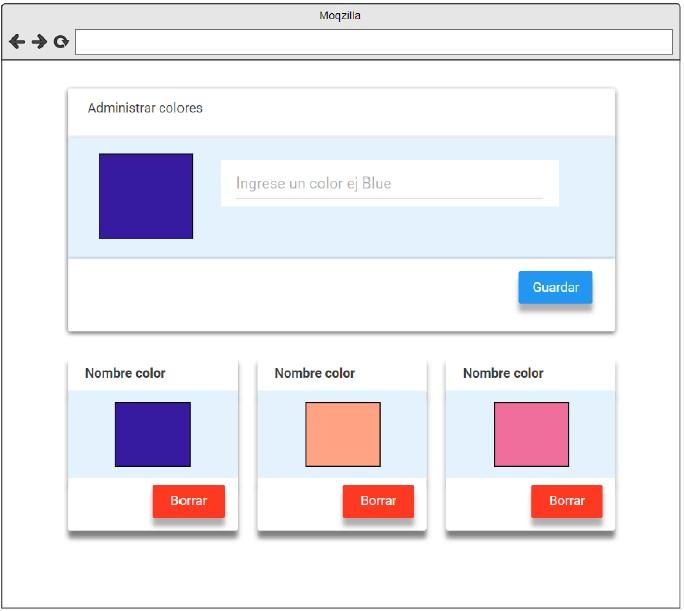

# Ejercicios React - Rolling Code School 
Prácticas con componentes, ciclo de vida del componente, eventos etc.

## Ejercicio N°6: Paleta de colores- Dificultad: 🟢🟡
Crear un proyecto de react que muestre un formulario con un input y un button
que permite guardar un color en el localstorage, similar a la siguiente imagen:

### Link de Deploy:
- [Netlify](https://lucasecapdevila-tpn6react76i.netlify.app/)